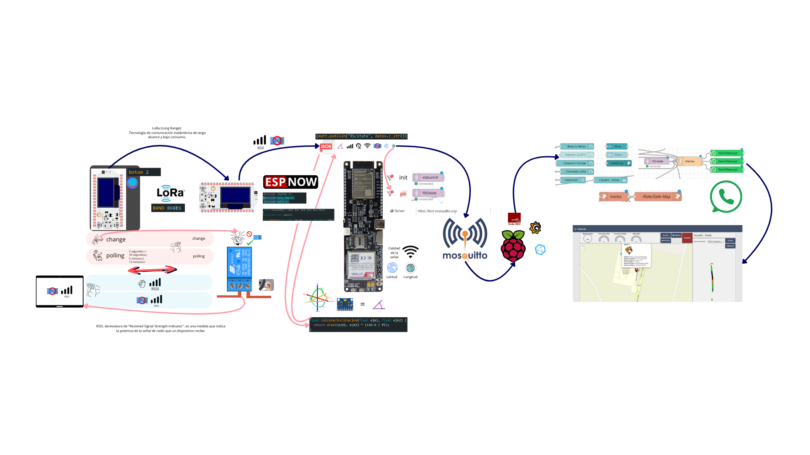
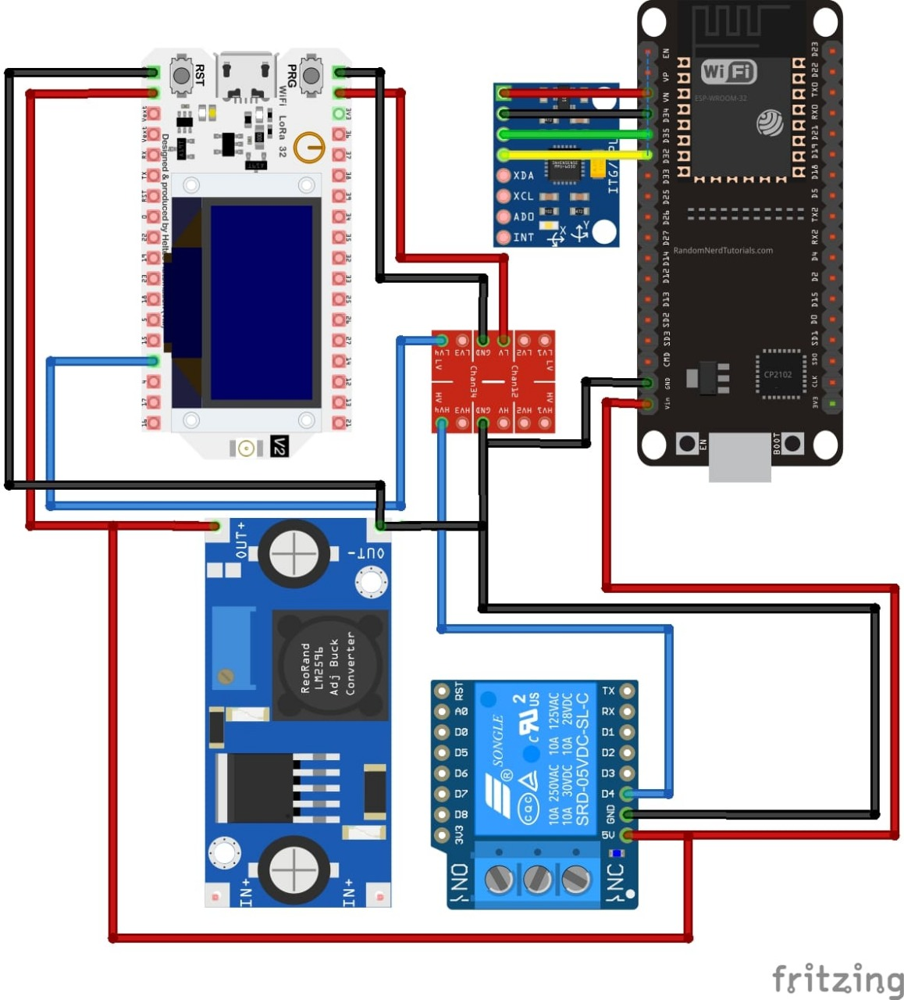
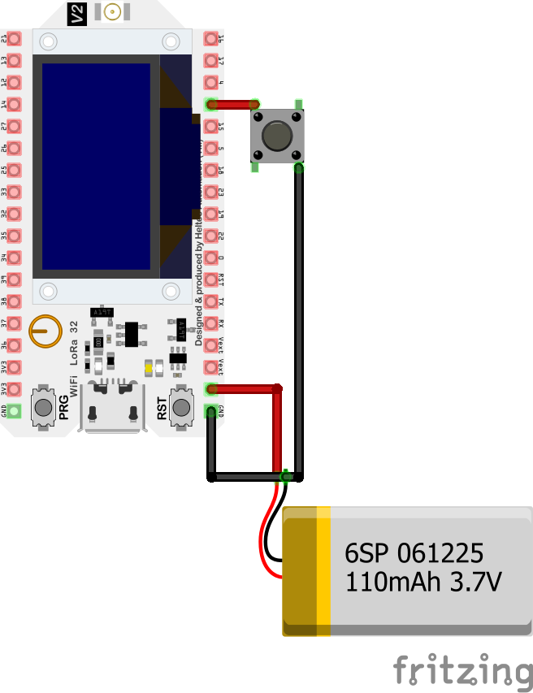

## 📁 diagramas

### Descripción

Esta carpeta contiene los diagramas que representan la arquitectura y el flujo de funcionamiento del sistema RiderSafe. Estos diagramas son esenciales para comprender la interacción entre los diferentes componentes del sistema.

### Contenido

* **Diagrama de flujo de datos**: Ilustra cómo se procesan y transmiten los datos dentro del sistema.

* **Diagrama de arquitectura del sistema**: Muestra cómo se interconectan los módulos de hardware y software.

*Diagrama de arquitectura prototipo*

*Diagrama de arquitectura del sistema portatil*

